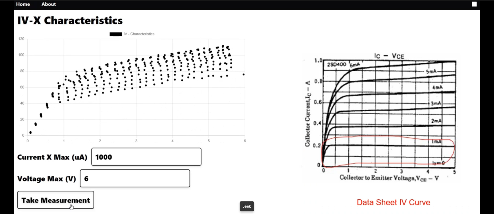

# Circuit King
This is a hardware tool with accompanying software to analyze circuits and test various components as an assistant to an electronic engineer. The tool includes an Oscilloscope (1 Msp/s), A Signal Generator (up to 200 kHz), an IV curve analyzer, a Transistor Characteristic Plotter, a Circuit Bode Plotter, Capacitor, Resistor, Inductor measurement among other things. Developed our own analog circuitry for the analysis. Digital Processing is done using a STM32 micorcontroller, while communi- cation with the user application is handled by an ESP32 microcontroller. The User application was developed using the Tauri Framework using React and Rust

## Demo Video
(Click to watch the Video)

## Demo Pictures
### App

### Oscilloscope

### Signal Generator

### Transistor Characteristics

